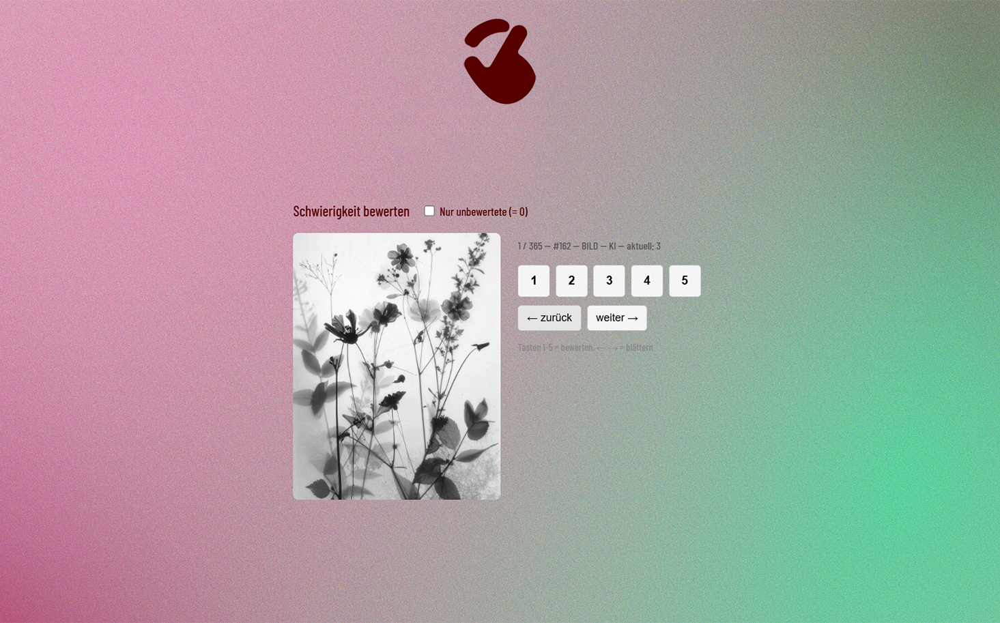

# SWAIPE Applikation
Ein Bachelorprojekt von Nadia Giliberti

## Kurzbeschreibung

SWAIPE ist eine mobile-first Web-App, mit der spielerisch trainiert wird, echte Medieninhalte von KI-generierten zu unterscheiden. Nach dem Vorbild der Swipe-Mechanik bekannter anderer Apps wird pro Karte ein Inhalt (Bild, Video, Audio oder Musik) angezeigt, den man per Wischgeste (oder Pfeiltasten/Buttons am Desktop) als „Echt" oder „KI" einordnet.

Es gibt drei Spielmodi:
- **Punkte-Modus**: 60 Sekunden Zeit, um so viele Inhalte wie möglich richtig zuzuordnen. Punkte hängen von der Schwierigkeit des Inhalts und dem eigenen Level in der jeweiligen Kategorie ab. Serien (Combos) geben zusätzliche Bonuspunkte. Eine fehlerfreie Runde wird extra belohnt. Bestwerte können bei den Highscores angeschaut werden.
- **Überlebensmodus**: kein Zeitlimit, dafür endet die Runde sofort bei der ersten falschen Antwort. Inhalte aus allen vier Kategorien werden zufällig gemischt, die Schwierigkeit steigt analog zum Punkte-Modus laufend an. Gewertet wird, wie viele Inhalte in Folge richtig erkannt wurden. Der eigene Bestwert wird gespeichert und mit Freund:innen verglichen.
- **Üben-Modus**: eine Kategorie (Bild/Video/Audio/Musik) wird gezielt und ohne Zeitdruck trainiert. Nach der Runde werden alle falsch beantworteten Inhalte nochmals mit der korrekten Auflösung angezeigt, damit gezielt aus den eigenen Fehlern gelernt werden kann.

Ergänzt wird das Ganze durch ein Level-System pro Kategorie und Highscores. Ein Freundschaftssystem mit globalem und freundesbezogenem Ranking (getrennt für Punkte- und Überlebensmodus), Sammelbare Abzeichen sowie ein personalisierbares Farb-Theme pro Nutzer:in.

## Learnings

- **Nuxt / Vue**
- **Supabase**
- **PWA**
- **Node.js Projekt im Server aufsetzen und verbinden**

Bis auf die kurzen Vorstellungsrunden im Major kannte ich diese Dinge noch nicht wirklich. 

## Schwierigkeiten

- Zurechtfinden in der "neuen Welt" von Nuxt, Vue und Supabase.
- Ladezeiten, sowohl beim ersten Laden der App als auch während des Spiels selbst bei einzelnen, insbesondere grösseren Spielinhalten (v. a. Videos). Trotz verschiedener Optimierungsversuchen, wie dem Vorladen der nächsten Inhalte, können in einzelnen Situationen weiterhin Ladezeiten auftreten.
  
## Known Bugs

- Je nach Netzwerkverbindung und Gerät kann es beim Laden der App und bei einzelnen Spielinhalten zu den bereits erwähnten Wartezeiten kommen.
- Bei einigen Audiodateien ist das Spulen während des Spiels möglich und bei anderen hingegen nicht. Das konnte nicht behoben werden, da ich den Fehler irgendwie nicht gefunden habe. 

**Testing-Einschränkung (Apple-Geräte):** Die App wurde primär auf Windows / Android (Samsung) getestet, da ich keine Apple Geräte in meinem Umfeld habe. Sowohl das Verhalten im Safari-Browser als auch PWA-spezifisches Verhalten unter iOS konnten dementsprechend leider nicht final geprüft werden.

## Datenstruktur

Die Daten werden vollständig in **Supabase** (Postgres) verwaltet. Das Schema besteht aus folgenden zentralen Tabellen:

- **profiles**: Enthält die Benutzerdaten wie Username, Profilbild, Highscores, Spielstatistiken, Level pro Kategorie sowie die gewählten Theme-Farben.
- **spieldaten**: Enthält alle Spielinhalte mit Datei-URL, Kategorie, Herkunft (KI oder Echt), Stil, Schwierigkeit sowie Statistiken zur Nutzung und den Spielergebnissen. Die eigentlichen Mediendateien der Spieldaten liegen nicht in Supabase, sondern direkt auf dem eigenen Server. In der Datenbank wird jeweils nur der Dateipfad referenziert.
- **freundschaften**: Verwaltet Freundschaftsanfragen und bestehende Freundschaften zwischen Nutzer:innen.
- **badges** und **user_badges**: Definieren die verfügbaren Achievements und speichern, welche Nutzer:innen diese erreicht haben.


## Ressourcen

### Schriftarten

- **DotGothic16** – Pixel-/Retro-Schrift für Überschriften, Labels und Zahlenanzeigen (Punkte, Timer).
- **Barlow Condensed** – schmale Schrift für Fliesstext und Statistiken.

Beide Schriften sind lokal als `.woff`/`.woff2`/`.eot` unter `public/fonts` eingebunden und über `app/assets/css/fonts.css` eingerichtet.

### Technologien

- **Nuxt 4** (Vue 3) als Frontend-Framework
- **Supabase** (Postgres-Datenbank, Authentifizierung, Datenhaltung) als Backend
- **Infomaniak** (Node.js-Hosting) für das Live-Deployment

### Spieldaten

Die im Spiel verwendeten Inhalte stammen aus verschiedenen Open-Source-Quellen wie Unsplash, Pixabay, Pexels, Mixkit, Suno, ElevenLabs.

Da die KI-Inhalte initial nach Schwierigkeit (1–5) eingestuft werden mussten, bevor genügend Spielerdaten für die dynamische Berechnung vorlagen, habe ich mir dafür ein kleines internes Tool gebaut. Es zeigt nacheinander alle KI-Inhalte einer Kategorie mit Fortschrittsanzeige (z. B. „1/365"), lässt sich per Tastatur (Zifferntasten 1–5 zum Bewerten, Pfeiltasten zum Blättern) durchgehen. So ging das Ganze etwas einfacher, als wenn ich jede Spieldatei manuell in der DB hinterlegt hätte. Nach der Bewertung der Spieldaten wurde die Subpage wieder entfernt. Diese initiale, manuelle Einstufung war nur der Startpunkt: Im laufenden Betrieb berechnet sich die Schwierigkeit eines Inhalts danach laufend neu, basierend darauf, wie oft er von Spieler:innen tatsächlich richtig oder falsch erkannt wurde.



## Projekt-Setup

### Voraussetzungen

- Node.js (v20.19.0 oder v22.12.0+)
- npm (wird mit Node.js installiert)
- Ein Supabase-Projekt mit folgenden Umgebungsvariablen in einer `.env`-Datei im Projektroot:
  - `NUXT_PUBLIC_SUPABASE_URL`
  - `NUXT_PUBLIC_SUPABASE_KEY`
  - `SUPABASE_SERVICE_ROLE_KEY` (für serverseitige Admin-Funktionen)

### Installation & Entwicklung

```bash
npm install
npm run dev
```

Um die TypeScript-Types nach Änderungen am Datenbankschema neu zu generieren:

```bash
npm run update-types
```
